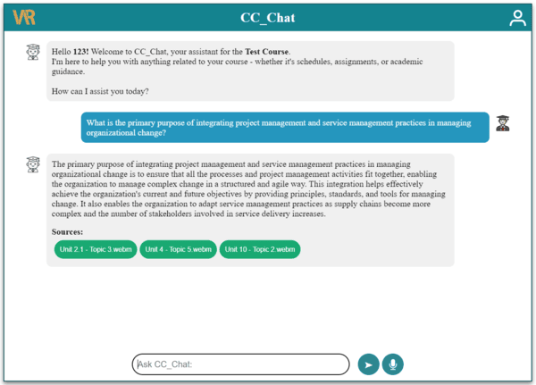

# ccchat-backend

# ccchat-backend

## Description
This project is designed to handle backend functionalities for a chatbot enabling students to ask course-related questions. The chatbot will access the course content, course outline, and instructional plan relevant to their program.

## Feature
Student Login: Students must enter their ID. The chatbot will only respond to questions related to their specific program.
Test Login ID: 123

## Installation
1. Clone the repository
```
git clone https://github.com/CVRIAI/ccchat-backend.git
```
2. Move to the backend directory
```
cd ccchat-backend
```
3. Install all of the packages 
```
pip install -r requirements.txt
```
4. Launch the application

    - Ensure that the IP addresses in the ccchat-frontend .env file and the ccchat-backend app_noHist.py file are the same.

    - Update all IP addresses in the Chatbot_LLM app_noHist.py file to match your local Ethernet adapter's vEthernet or Wi-Fi(IPv4 Address)

    **Backend**: 
    
    - Switch directory
        ```
        cd ccchat-backend
        ```
        
    - Run the code
        ```
        python app_noHist.py
        ```

## Running as a Service
To run the backend:

1. Add the following environment variables to the service file:
    GROQ_API_KEY=${GROQ_API_KEY}
    LANGCHAIN_API_KEY=${LANGCHAIN_API_KEY}
    OPENAI_API_KEY=${OPENAI_API_KEY}

## Demo
- Ask course content related question
    